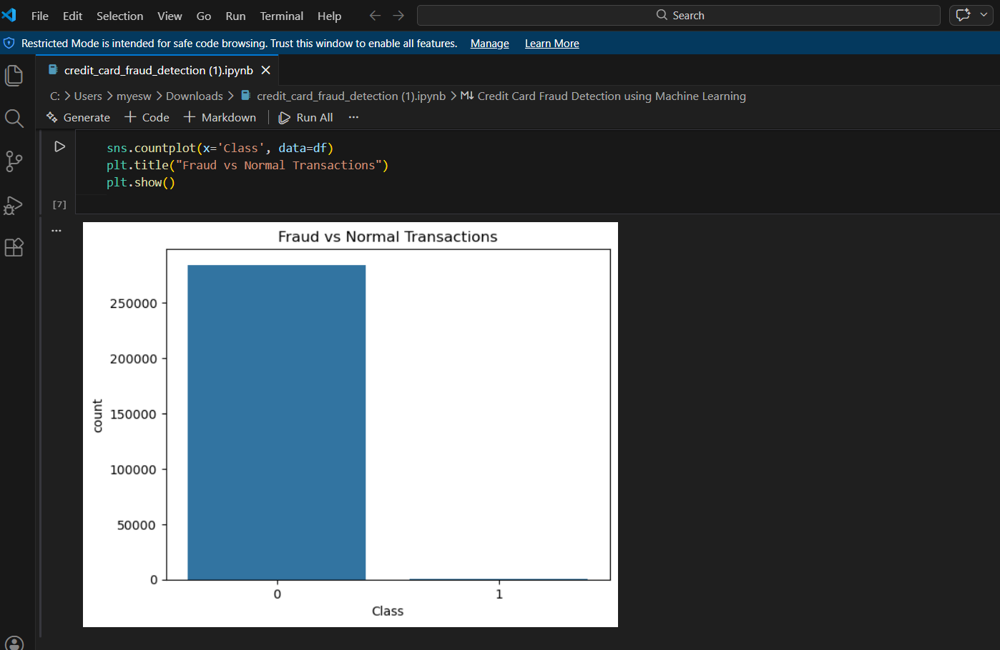
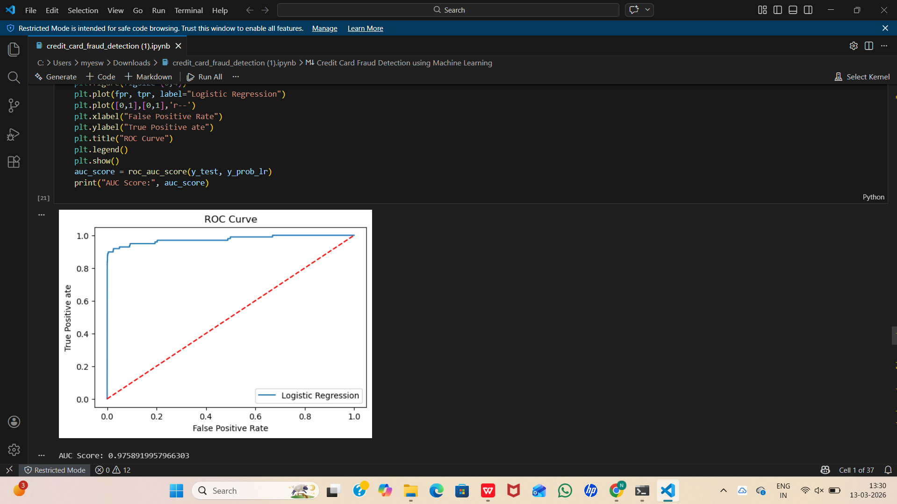

# Credit Card Fraud Detection using Machine Learning

## Overview

Credit card fraud detection is a critical challenge in the financial industry. Fraudulent transactions cause significant financial losses for banks and customers. This project applies machine learning techniques to detect fraudulent credit card transactions from a highly imbalanced dataset.

The objective of this project is to build and evaluate machine learning models that can effectively classify transactions as **legitimate** or **fraudulent**.

---

## Problem Statement

Financial institutions process millions of transactions daily, but only a very small percentage of them are fraudulent. Because of this extreme imbalance, detecting fraud becomes a challenging machine learning problem.

This project aims to develop a model that can accurately identify fraudulent transactions while minimizing false alarms.

---

## Dataset

The dataset contains credit card transactions made by European cardholders.

Dataset characteristics:

* Total transactions: **284,807**
* Fraudulent transactions: **492**
* Legitimate transactions: **284,315**
* Fraud cases represent only **0.17%** of all transactions.

Dataset source:
https://www.kaggle.com/datasets/mlg-ulb/creditcardfraud

---

## Exploratory Data Analysis

Exploratory Data Analysis (EDA) was performed to understand the structure and distribution of the dataset.

Analysis performed:

* Class distribution analysis
* Feature correlation analysis
* Transaction amount distribution
* Heatmap visualization of feature relationships

---

## Class Imbalance Visualization

The dataset is extremely imbalanced. The majority of transactions are legitimate while only a very small fraction are fraudulent.

---

## Handling Imbalanced Data

Since the dataset is highly imbalanced, **SMOTE (Synthetic Minority Over-sampling Technique)** was used to balance the training data.

SMOTE generates synthetic samples of the minority class (fraud cases), helping machine learning models learn better fraud patterns.

---

## Machine Learning Models

Two machine learning algorithms were implemented and compared:

### Logistic Regression

A baseline classification algorithm used to evaluate initial fraud detection capability.

### Random Forest

An ensemble learning algorithm that builds multiple decision trees and aggregates their predictions. Random Forest performed better due to its ability to capture complex patterns in the data.

---

## Model Evaluation

The models were evaluated using multiple performance metrics:

* Accuracy
* Confusion Matrix
* Precision
* Recall
* F1 Score
* ROC Curve
* AUC Score

These metrics help measure both overall prediction accuracy and fraud detection capability.

---

## ROC Curve

The ROC Curve illustrates the model's ability to distinguish between fraudulent and legitimate transactions. A higher AUC score indicates better model performance.

---

## Feature Importance

Random Forest feature importance analysis was used to identify the most influential features contributing to fraud detection. This helps understand which transaction characteristics are most relevant for detecting fraudulent activity.

---

## Model Saving

The trained Random Forest model was saved using Python's **pickle** library so that it can be reused later without retraining.

Saved model file:

credit_fraud_model.pkl

---

## Technologies Used

* Python
* Pandas
* NumPy
* Matplotlib
* Seaborn
* Scikit-learn
* imbalanced-learn (SMOTE)

---

## Project Structure

credit-card-fraud-detection
│
├── credit_card_fraud_detection.ipynb
├── credit_fraud_model.pkl
├── fraud_distribution.png
├── roc_curve.png
└── README.md

---

## Conclusion

This project demonstrates how machine learning techniques can be applied to detect fraudulent credit card transactions from highly imbalanced data.

Using SMOTE for class balancing and Random Forest for classification significantly improved fraud detection performance. Such models can assist financial institutions in identifying suspicious transactions and reducing financial losses caused by fraud.

---

## Author

Manneti Yeswanth Reddy
B.Tech – Artificial Intelligence and Data Science
Saveetha School of Engineering
